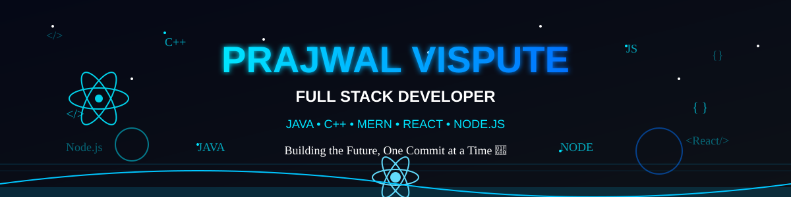

<p align="center">

</p>
<div align="center">

#  Hey, I'm **Prajwal Vispute**


</div>

---


# 💫 About Me

🎓 Student + Full Stack Developer

💻 Passionate about building scalable web applications.

🚀 MERN Stack Developer

🌱 Currently learning Advanced Backend Development.

⚡ Love Java, C++, React and Node.js.

🎯 Goal:
Become a Software Engineer at a top product company.

---

# 🌐 Connect With Me

<p align="left">

<a href="https://www.linkedin.com/in/prajwal-vispute-52242a404/">

</a>

<a href="mailto:prajwalvispute6@gmail.com">

</a>

</p>

---

# 💻 Tech Stack

<p align="center">


</p>

---

# 🚀 Languages

<p align="center">


</p>

---

# 🚀 Frameworks

<p align="center">


</p>

---

# ⚡ Fun Fact

```javascript
const prajwal = {
    role: "Full Stack Developer",
    code: ["Java","C++","JavaScript"],
    technologies: ["React","Node","Express","MongoDB"],
    currentlyLearning: "Advanced MERN Stack",
    lifeMotto: "Code • Learn • Build • Repeat 🚀"
}
```

---

<div align="center">

## ⭐ "Dream Big. Code Bigger."

</div>
---

# 📊 GitHub Analytics

<div align="center">


</div>

<br>

<div align="center">


</div>

---

# 🏆 GitHub Trophies

<div align="center">


</div>

---

# 📈 Contribution Graph

<div align="center">


</div>

---

# 🐍 Contribution Snake

<div align="center">


</div>

---

# ⚡ Development Philosophy

```text
while(alive){

    Eat();

    Sleep();

    Code();

    Learn();

    Repeat();

}
```

---

# 💻 Current Focus

```yaml
Name: Prajwal Vispute

Role: Full Stack Developer

Education: Student

Learning:
  - Advanced MERN Stack
  - System Design
  - Backend Development

Languages:
  - Java
  - C++
  - JavaScript
  - SQL

Frameworks:
  - React
  - Node.js
  - Express

Database:
  - MongoDB
  - MySQL

Tools:
  - Git
  - GitHub
  - VS Code

Goal:
  Become a Software Engineer 🚀
```

---

# 📚 Currently Learning

<div align="center">

🟢 React Advanced

███████████░░░░ 75%

🟢 NodeJS

████████████░░ 80%

🟢 MongoDB

██████████░░░░ 70%

🟢 System Design

███████░░░░░░░ 50%

🟢 DSA

███████████░░░ 75%

</div>

---

# ☕ Random Dev Quote

<div align="center">


</div>

---

# 🎯 2026 Goals

✅ Build Amazing Projects

⬜ Master MERN Stack

⬜ Learn Docker

⬜ Learn AWS

⬜ Contribute to Open Source

⬜ 500+ GitHub Contributions

⬜ 100+ Followers

⬜ Land a Software Developer Role

---

# 🎵 Coding Mood

<div align="center">

### 🎧 Eat 🍕 • Code 💻 • Sleep 😴 • Repeat 🔁

</div>

---

# 👀 Profile Visitors

<div align="center">


</div>

---

<div align="center">

## ⭐ If you like my work, consider starring my repositories!


</div>
---

# 🚀 Featured Projects

<div align="center">

| Project | Description | Tech |
|---------|-------------|------|
| 🌐 Portfolio Website | Personal Portfolio | HTML • CSS • JS |
| 💬 Chat Application | Real-time Chat App | MERN |
| 🛒 E-Commerce Website | Full Stack Shopping Platform | React • Node • MongoDB |
| 📋 Task Manager | Productivity App | React • Express |
| 🤖 AI Assistant | AI Powered Chatbot | JavaScript |

</div>

---

# 🎖️ Achievements

<div align="center">

🥇 Full Stack Developer

🚀 MERN Stack Developer

💻 Java Developer

⚛️ React Developer

🌍 Open Source Enthusiast

📚 Lifelong Learner

</div>

## 🐍 Contribution Snake

<p align="center">
  
</p>
---

# 💼 Developer Toolkit

<p align="center">


</p>

---

# 📫 Contact

<div align="center">

📧 **Email**

prajwalvispute6@gmail.com

💼 **LinkedIn**

https://www.linkedin.com/in/prajwal-vispute-52242a404/

</div>

---

# 🌟 Support

If you enjoy my work,

⭐ Star my repositories

🍴 Fork projects

🤝 Follow me on GitHub

---

<div align="center">

# 💙 Thanks for visiting!


</div>
